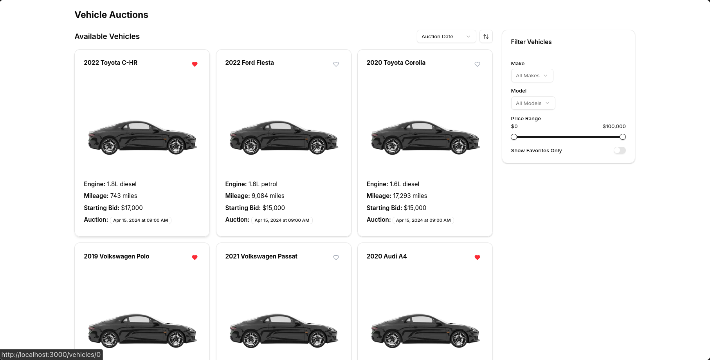

# Vehicle Auctions Platform

A modern web application for browsing and bidding on vehicle auctions, built with next.js 15.3.0 and React 19.

## 📋 Table of Contents

- [Overview](#overview)

- [Features](#features)

- [Tech Stack](#tech-stack)

- [Getting Started](#getting-started)

  - [Prerequisites](#prerequisites)

  - [Installation](#installation)

  - [Running the Development Server](#running-the-development-server)

  - [Building for Production](#building-for-production)

- [Project Structure](#project-structure)

- [Key Components](#key-components)

- [Testing](#testing)

- [Deployment](#deployment)

- [Contributing](#contributing)

- [License](#license)

## 🚀 Overview

The Vehicle Auctions Platform provides a user-friendly interface for browsing and filtering on vehicle auctions. Users can view detailed information about each vehicle, mark favorites, and sorts listings on various criteria.

## ✨ Features

- **Vehicle Listings**: Browse through available vehicles with detailed information

- **Advanced Filtering**: Filter vehicles by make, model, price range, and more

- **Favorites**: Mark vehicles as favorites for easy access

- **Sorting Options**: Sort vehicles by make, starting bid, mileage, or auction date

- **Responsive Design**: Optimized for both desktop and mobile devices

- **Pagination**: Navigate through multiple pages of vehicle listings
